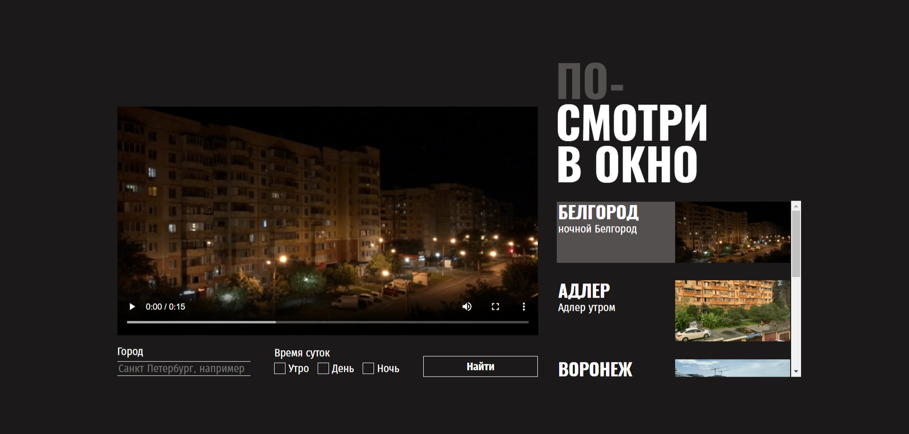

https://github.com/Murka69/posmotri_v_okno

# 🖼️ Проект «Посмотри в окно»

Простое, но атмосферное веб-приложение, которое предлагает пользователю сделать паузу и насладиться видом из "окна" — будь то природа, город или абстрактная сцена. Приложение адаптируется под любой экран и предоставляет приятный интерфейс без лишних отвлекающих деталей.

---

## 🎯 Цель проекта

Создать **адаптивный пользовательский интерфейс**, который будет корректно отображаться и удобно использоваться на устройствах с различными размерами экранов — от мобильных телефонов до десктопных мониторов.

Для достижения этой цели были применены современные подходы к верстке:

- **Flexbox** использовался для гибкого позиционирования элементов, особенно в блоках навигации и управления.
- **CSS Grid Layout** применялся для построения сложных сеток контента, таких как карточки с информацией или элементы интерфейса с фиксированным расположением.

Также задачей было:

> Написать чистый и оптимизированный CSS для работающего приложения, имея уже готовую HTML-разметку, CSS для компонентов прелоадера и вывода ошибки, файлы шрифтов и JS-логику.

---

## 🧩 Функционал

Проект включает следующие ключевые элементы:

- **Адаптивный интерфейс**, который корректно отображается на мобильных, планшетах и десктопах.
- **Прелоадер**, отображающийся во время загрузки данных или изображений.
- **Вывод сообщения об ошибке**, если что-то пошло не так (например, проблема с API или сетью).
- **Шрифты**, подключённые локально для улучшения производительности и кастомизации дизайна.
- **Интерактивность**, реализованная через JavaScript, включая смену фона, управление состояниями и взаимодействие с пользователем.

---

## 🛠 Технологии

Для реализации проекта были использованы следующие технологии:

| Технология                     | Назначение                             |
| ------------------------------ | -------------------------------------- |
| **HTML5**                      | Структура страницы                     |
| **CSS3 (Flexbox, Grid)**       | Адаптивная и семантическая верстка     |
| **JavaScript**                 | Логика работы приложения               |
| **Google Fonts / Local Fonts** | Кастомные шрифты для улучшения дизайна |

---

## 💡 Особенности проекта

- **Полностью адаптивный дизайн**, созданный с применением Flexbox и CSS Grid.
- Чистая и понятная структура CSS с разделением на компоненты.
- Пользовательский опыт усилен плавными анимациями и переходами.
- Удобное отображение ошибок и загрузки контента.

---

## ▶ Как запустить проект локально

1. Склонируйте репозиторий:
   ```bash
   git clone https://github.com/ ваше-имя-пользователя/posmotri-v-okno.git
   ```
2. Перейдите в папку проекта:
   ```bash
   cd posmotri-v-okno
   ```
3. Откройте файл `index.html` в браузере — сайт готов к просмотру!
---
## Предварительный просмотр



Макет: [Figma](https://www.figma.com/design/ZDeTVozbLvvA6v5EG41LsJ/-4-Посмотри-в-окно--Copy-?node-id=0-1&p=f&t=T1gjGuV5tOZcVR8N-0)